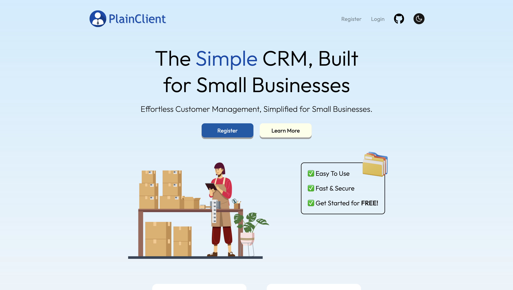

<h1 align="center">PlainClient</h1>

  A clean, intuitive CRM designed to help freelancers and small businesses manage personal and business data separately — without complexity, clutter, or enterprise bloat.

<h2>✨ Key Features</h2>
<ul>
  <li>Clear separation between personal and business data</li>
  <li>Client, task, and financial tracking in one place</li>
  <li>Modern, distraction-free interface built for everyday use</li>
  <li>Fast, responsive experience across desktop and mobile</li>
  <li>Designed for freelancers, creators, and small teams</li>
</ul>

<h2>🧠 Built for Real Life</h2>

  PlainClient focuses on the essentials — helping you stay organized without forcing you into rigid workflows. 
  Whether you're managing clients, tracking income and expenses, or keeping tabs on tasks, everything is designed to feel straightforward and intentional.

<h2>🔒 Privacy & Data Control</h2>

  Your data stays yours. PlainClient is built with a privacy-first mindset, prioritizing secure data handling and transparency. 
  There’s no unnecessary tracking, no selling of user data, and no hidden analytics running behind the scenes.

<h2>🚀 Vision</h2>

  PlainClient aims to be the go-to CRM for people who want clarity — not complexity. 
  A tool that respects your time, your data, and the fact that personal and business lives should work together without being mixed up.

<h3>Framework Used:</h3>

<h3>Technologies Used:</h3>

 
 

